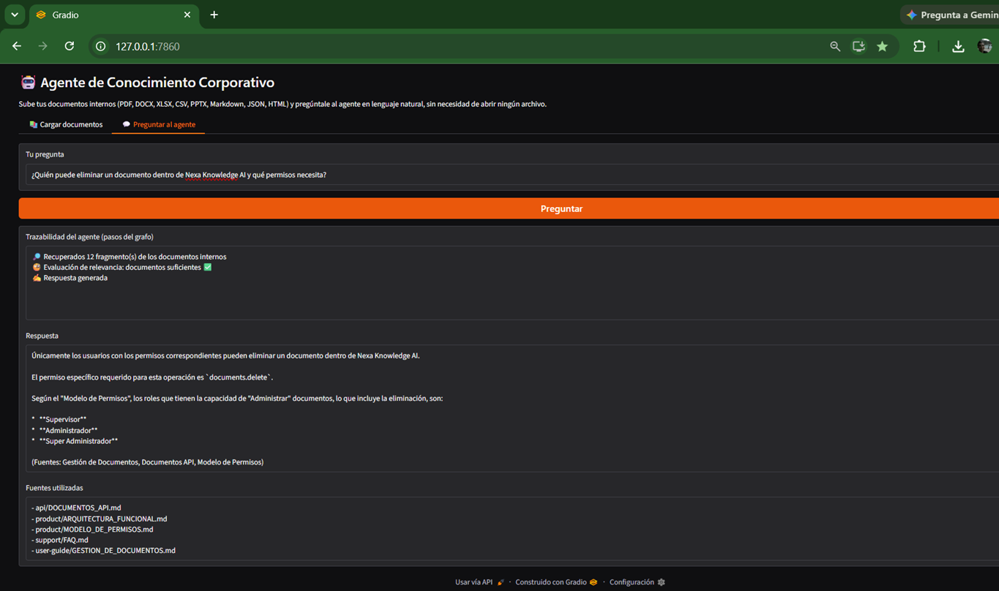

# 🤖 Agente de Conocimiento Corporativo (Alura Agentes Challenge)

Agente de inteligencia artificial que permite a cualquier colaborador de una empresa
hacer preguntas en lenguaje natural sobre sus documentos internos (manuales, políticas,
informes, hojas de cálculo, etc.) y recibir respuestas directas, sin tener que abrir
ningún archivo.

Construido con **Python + LangChain + LangGraph + Gemini**, siguiendo el patrón de
grafo de agentes visto en el curso *"LangGraph: Orquestación de agentes y multiagentes"*.

---

## 🧩 Problema que resuelve

Empresas (fintechs, consultoras, startups) acumulan grandes volúmenes de documentos
—manuales, políticas, hojas de cálculo, informes— y sus colaboradores pierden horas
buscando información dentro de ellos. Este agente centraliza esos documentos en una
base de conocimiento conversacional, siempre disponible, que responde preguntas al
instante.

Como caso de estudio, el repositorio incluye la documentación curada de una empresa
ficticia, **NexaDigital S.A.S.**, desarrolladora del producto **Nexa Knowledge AI**
(casualmente, una plataforma de conocimiento con IA muy similar a este mismo desafío).
La documentación cubre desde arquitectura de producto y API hasta RRHH, seguridad,
legal y DevOps — organizada por categoría en `docs/`.

---

## 🏗️ Arquitectura

El proyecto tiene dos grandes componentes:

### 1. Ingestión de documentos (`ingestion.py`)
Lee documentos en múltiples formatos —**PDF, Word (.docx), Excel (.xlsx/.xls), CSV,
PowerPoint (.pptx), Markdown, JSON y HTML**—, los normaliza a un formato común
(`Document` de LangChain), los divide en fragmentos (chunks) y genera embeddings
con el modelo `gemini-embedding-001` de Gemini. Estos embeddings se guardan en un
índice vectorial **FAISS** en disco (`vectorstore_index/`).

### 2. Agente conversacional con LangGraph (`agent.py`)
Implementa un grafo de tipo **Corrective RAG (CRAG)**:

```
        ┌────────────┐
        │  retrieve  │  <- busca los fragmentos más relevantes en FAISS
        └─────┬──────┘
              │
        ┌─────▼───────────┐
        │ grade_documents  │  <- un LLM evalúa si los fragmentos alcanzan
        └─────┬────────────┘     para responder la pregunta
              │
      ┌───────┴────────┐
      │                │
 (no alcanzan)     (alcanzan)
      │                │
┌─────▼──────┐         │
│transform_  │         │
│  query     │         │
└─────┬──────┘         │
      │                │
┌─────▼──────┐         │
│web_search  │         │   (búsqueda de respaldo con Tavily,
│ (Tavily)   │         │    solo si se configuró TAVILY_API_KEY)
└─────┬──────┘         │
      │                │
      └───────┬────────┘
              │
        ┌─────▼──────┐
        │  generate  │  <- redacta la respuesta final citando la fuente
        └────────────┘
```

Cada nodo del grafo va registrando su propio paso (`steps`), por lo que la interfaz
puede mostrar en tiempo real qué está haciendo el agente (recuperar → evaluar →
generar), igual que el patrón de streaming del ejemplo original del curso.

El estado del grafo se persiste con `SqliteSaver` (checkpoints por conversación),
igual que en el ejemplo base del curso.

### 3. Interfaz (`app.py`)
Aplicación **Gradio** con dos pestañas:
- **Cargar documentos**: sube archivos y reconstruye el índice vectorial.
- **Preguntar al agente**: escribe una pregunta y observa la traza del razonamiento,
  la respuesta final y las fuentes utilizadas.

---

## 💬 Ejemplos de preguntas y respuestas

Usando la documentación curada de **NexaDigital S.A.S.** sobre su producto **Nexa
Knowledge AI**, incluida en `docs/`:

| Pregunta | Fuente(s) | Respuesta esperada |
|---|---|---|
| ¿Quién puede eliminar un documento dentro de Nexa Knowledge AI y qué permisos necesita? | `product/MODELO_DE_PERMISOS.md`, `api/DOCUMENTOS_API.md`, `user-guide/GESTION_DE_DOCUMENTOS.md` | Solo usuarios con permisos de administración (`documents.delete`); los roles Supervisor, Administrador y Super Administrador pueden hacerlo |
| ¿Puede un Editor crear un Agente IA? | `product/MODELO_DE_PERMISOS.md` | Sí, siempre que la organización le haya concedido el permiso correspondiente |
| ¿Qué pasa con mis conversaciones anteriores si elimino un documento? | `support/FAQ.md` | El documento deja de estar disponible para futuras consultas, pero las conversaciones anteriores no se modifican automáticamente |
| ¿Qué son los Embeddings y para qué se usan en la plataforma? | `support/FAQ.md`, `ai/ARQUITECTURA_RAG.md` | Representaciones vectoriales del contenido de los documentos, usadas para hacer búsquedas semánticas |
| ¿Qué estados puede tener un documento durante su procesamiento? | `api/DOCUMENTOS_API.md`, `user-guide/GESTION_DE_DOCUMENTOS.md` | Cargando/Uploading, Validando, Procesando, Indexando, Disponible/Available, Error/Failed, Archivado, Eliminado |

Esta última pregunta es un buen caso de prueba de "consistencia entre documentos": el
estado de un documento aparece descrito tanto a nivel de API (`api/DOCUMENTOS_API.md`,
en inglés técnico: `UPLOADING`, `VALIDATING`...) como a nivel funcional para el usuario
final (`user-guide/GESTION_DE_DOCUMENTOS.md`, en español: "Cargando", "Procesando"...).
El agente debería reconocer que ambas tablas describen el mismo flujo desde dos
perspectivas distintas, sin contradecirse.
Con la documentación actual (40 documentos), el agente ya puede responder preguntas bastante completas sobre funcionamiento del producto, arquitectura, administración, seguridad, negocio, legal y recursos humanos.

Estas son **10 preguntas realistas** que un colaborador podría hacerle al agente:

1. **¿Quién puede eliminar un documento dentro de Nexa Knowledge AI y qué permisos necesita?**

   *El agente debería consultar el Modelo de Permisos y las Reglas de Negocio para explicar los roles autorizados y las restricciones.*

---

2. **¿Cómo funciona el Agente de IA cuando hago una pregunta sobre un manual interno?**

   *Debería explicar el flujo RAG: consulta → búsqueda semántica → recuperación de documentos → construcción del contexto → generación de la respuesta.*

---

3. **¿Qué ocurre cuando subo una nueva versión de un documento?**

   *El agente debería responder utilizando el Ciclo de Vida de los Documentos, Versionado del Producto y Gestión de Documentos.*

---

4. **¿Cuál es la diferencia entre los planes Professional, Business y Enterprise?**

   *Debe comparar capacidades, límites, API, almacenamiento, usuarios, soporte e integraciones utilizando Comparativa de Planes y Planes y Precios.*

---

5. **¿Qué responsabilidades tiene un Administrador de la plataforma?**

   *Debe resumir el Manual del Administrador, Configuración Global, Política de Seguridad y Reglas de Negocio.*

---

6. **¿Qué debo hacer si detecto un posible incidente de seguridad?**

   *El agente debería indicar el procedimiento descrito en la Política de Seguridad, Cumplimiento Normativo y Políticas Internas.*

---

7. **¿Qué arquitectura utiliza Nexa Knowledge AI y por qué se eligió una arquitectura de microservicios?**

   *Debe combinar información de Arquitectura Técnica, Arquitectura de Microservicios y Arquitectura Funcional.*

---

8. **¿Puedo utilizar ChatGPT u otra IA externa con información confidencial de la empresa?**

   *La respuesta debería basarse en Políticas Internas, Política de Seguridad y Cumplimiento Normativo, indicando que solo pueden utilizarse herramientas autorizadas y que no debe compartirse información confidencial.*

---

9. **¿Qué pasa si un cliente deja de pagar su suscripción?**

   *Debe responder utilizando Facturación y Términos de Uso, explicando suspensión del servicio, intentos de cobro y responsabilidades.*

---

10. **Soy un desarrollador nuevo. ¿Qué documentos debo leer durante mi primera semana?**

*El agente debería generar un plan basado en el Manual de Onboarding, incluyendo Arquitectura Técnica, Arquitectura RAG, Reglas de Negocio, Convenciones Backend/Frontend y Política de Seguridad.*

---

## Ejemplos de preguntas más avanzadas

Una de las fortalezas del agente será responder preguntas que requieran **combinar varios documentos**, por ejemplo:

* *¿Qué documentos debo revisar para agregar un nuevo endpoint a la API de documentos?*
* *¿Qué diferencias existen entre un Workspace y una Organización?*
* *¿Cómo se autentica una aplicación externa antes de consumir la API?*
* *¿Qué controles de seguridad protegen los documentos internos?*
* *¿Cómo se recupera el sistema después de un desastre?*
* *¿Qué reglas de negocio se aplican cuando un usuario elimina un documento?*
* *¿Qué responsabilidades tiene el equipo DevOps durante un despliegue?*
* *¿Qué documentos regulan el tratamiento de datos personales?*
* *¿Qué arquitectura utiliza el motor RAG y cómo interactúa con el LLM?*
* *¿Qué permisos necesita un usuario para administrar Workspaces y documentos?*

Este tipo de consultas son precisamente las que demuestran el valor de un sistema RAG: el agente no responde desde un único documento, sino que **recupera información de múltiples fuentes, la relaciona y genera una respuesta unificada con contexto**, que es el objetivo principal de **Nexa Knowledge AI**.

Si la pregunta no puede responderse con los documentos internos y se configuró
`TAVILY_API_KEY`, el agente reformula la pregunta y busca en la web como respaldo,
indicándolo explícitamente en la respuesta.

---

## ⚙️ Instrucciones para ejecutar el proyecto

### 1. Clonar el repositorio
```bash
git clone <URL_DE_TU_REPOSITORIO>
cd agente-corporativo
```

### 2. Crear entorno virtual e instalar dependencias
```bash
python -m venv venv
source venv/bin/activate   # En Windows: venv\Scripts\activate
pip install -r requirements.txt
```

### 3. Configurar variables de entorno
```bash
cp .env.example .env
```
Edita `.env` y agrega tu `GEMINI_API_KEY` (obligatoria) y, si quieres respaldo con
búsqueda web, tu `TAVILY_API_KEY` (opcional).

### 4. Generar el índice vectorial con los documentos
El script procesa automáticamente `docs/` (documentación curada de la empresa, organizada
por categoría: `docs/company/`, `docs/product/`, `docs/ai/`, `docs/hr/`, etc.) y `sample_docs/`
(archivos sueltos o de prueba), combinando ambas carpetas en un solo índice. Formatos
soportados: PDF, DOCX, XLSX, CSV, PPTX, Markdown, JSON y HTML.
```bash
python ingestion.py
```

### 5. Ejecutar la aplicación
```bash
python app.py
```
Esto abrirá una interfaz web local donde puedes cargar más documentos o preguntarle
directamente al agente.

---

## ☁️ Despliegue en la nube

Este proyecto está pensado para desplegarse en servicios como **Hugging Face Spaces**,
**Render** o **Google Cloud Run**. Pasos generales:
1. Sube el repositorio a GitHub.
2. Crea un nuevo Space/servicio conectado al repositorio.
3. Configura las variables de entorno (`GEMINI_API_KEY`, `TAVILY_API_KEY`) como
   secretos del servicio.
4. Define el comando de arranque: `python app.py`.

> 📸 *Agrega aquí una imagen o video del agente ejecutándose en la nube, como pide
> el desafío.*

---

## 🛠️ Tecnologías utilizadas

- **Python** — lenguaje principal
- **LangChain** — carga y división de documentos, embeddings
- **LangGraph** — orquestación del agente como grafo de estados
- **Gemini (Google Generative AI)** — modelo de lenguaje y embeddings
- **FAISS** — índice vectorial para búsqueda semántica
- **Gradio** — interfaz de usuario
- **Tavily** (opcional) — búsqueda web de respaldo
- **pypdf, python-docx, python-pptx, pandas, BeautifulSoup** — lectores de cada
  formato de documento

---

## 📂 Estructura del repositorio

```
agente-corporativo/
├── app.py                  # Interfaz Gradio
├── agent.py                # Grafo LangGraph del agente (Corrective RAG)
├── ingestion.py             # Carga de documentos + creación del índice FAISS
├── requirements.txt
├── .env.example
├── .gitignore
├── README.md
├── docs/                    # Documentación curada de la empresa, por categoría
│   ├── company/
│   ├── product/
│   ├── user-guide/
│   ├── ai/
│   ├── api/
│   ├── admin/
│   ├── security/
│   ├── engineering/
│   ├── devops/
│   ├── support/
│   ├── business/
│   ├── legal/
│   └── hr/
└── sample_docs/             # Archivos sueltos / de prueba, subidos desde la interfaz
```

Cada fragmento recuperado del índice conserva dos metadatos útiles: `source` (ruta relativa,
ej. `product/Roadmap del Producto.md`) y `area` (la subcarpeta de primer nivel, ej. `product`),
lo que permite escalar de 40 a 97 documentos sin cambiar el código de ingestión — solo hay
que agregar archivos dentro de las subcarpetas correspondientes de `docs/`.

---

## ✅ Estado de la validación

- [x] Lee y procesa múltiples formatos de documento (PDF, Word, Excel, PowerPoint,
      Markdown, CSV, JSON, HTML).
- [x] Responde preguntas en lenguaje natural con base en esos documentos.
- [x] Interfaz accesible para cualquier colaborador (sin restricciones de acceso).
- [x] Documentación con arquitectura, ejemplos e instrucciones de ejecución.